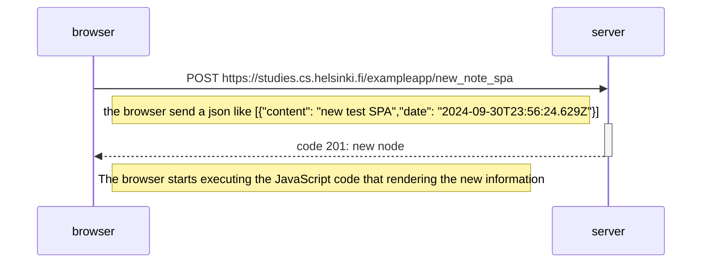

```mermaid
sequenceDiagram
    
    participant browser
    participant server
    
    browser->>server: POST https://studies.cs.helsinki.fi/exampleapp/new_note_spa
    note right of browser: the browser send a json like  [{"content": "new test SPA","date": "2024-09-30T23:56:24.629Z"}]
    activate server
    server-->>browser: code 201: new node
    deactivate server
    
    Note right of browser: The browser starts executing the JavaScript code that rendering the new information
   

```